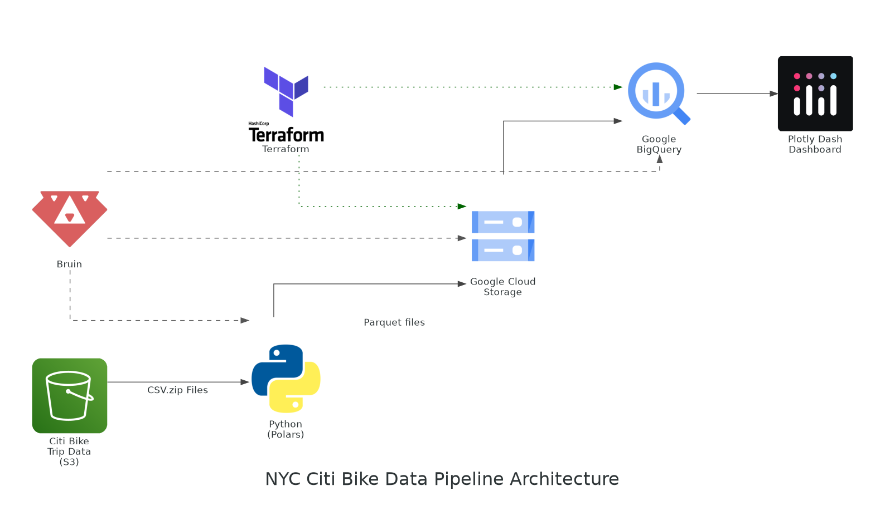
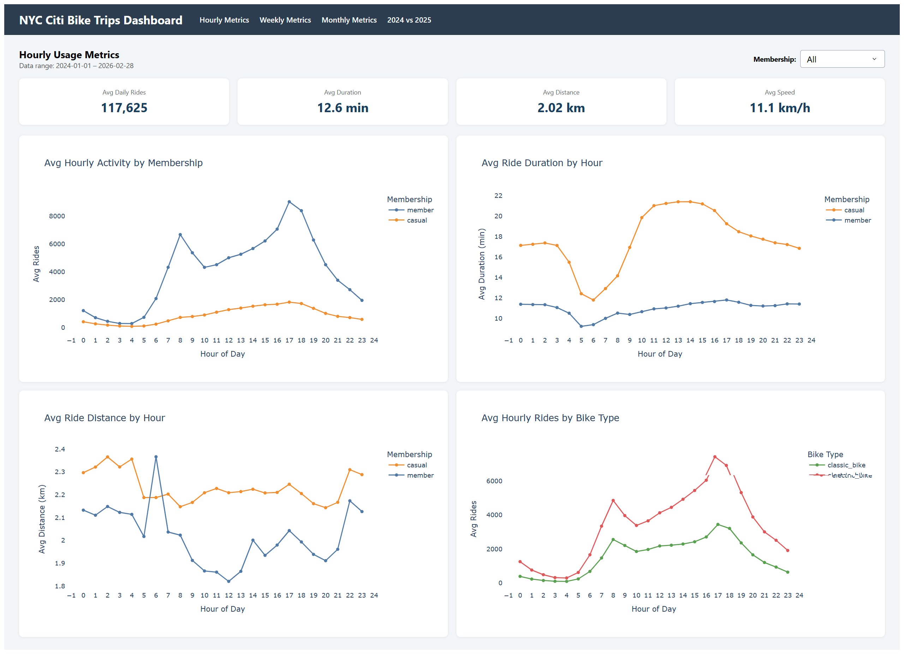
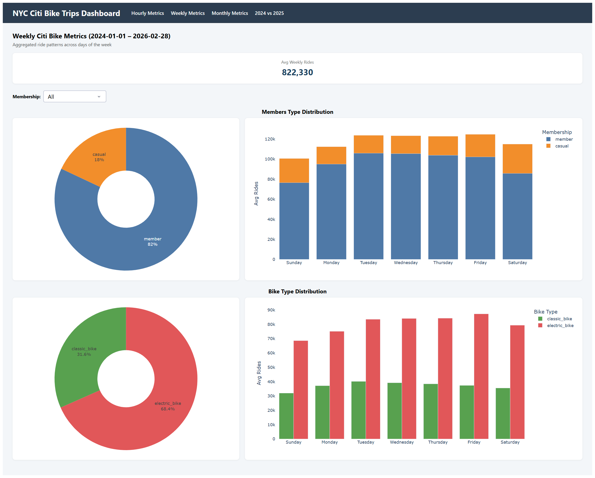
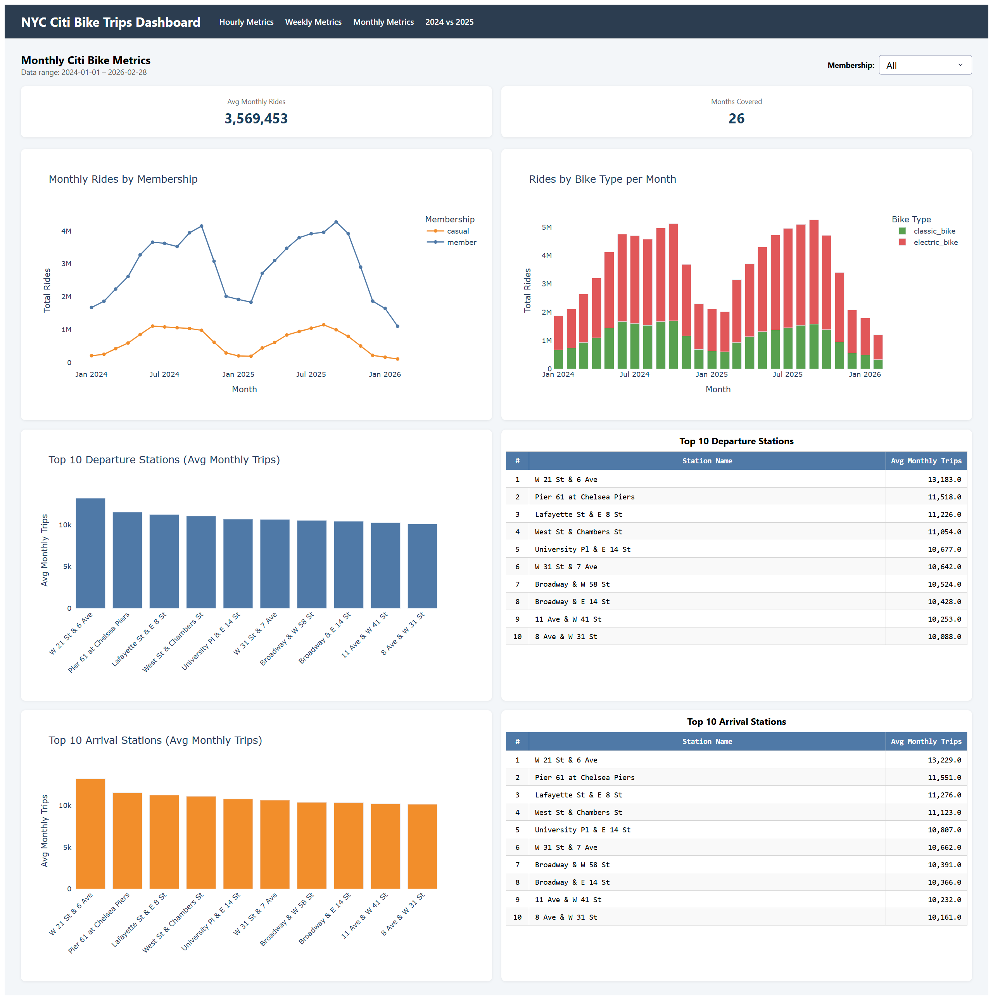
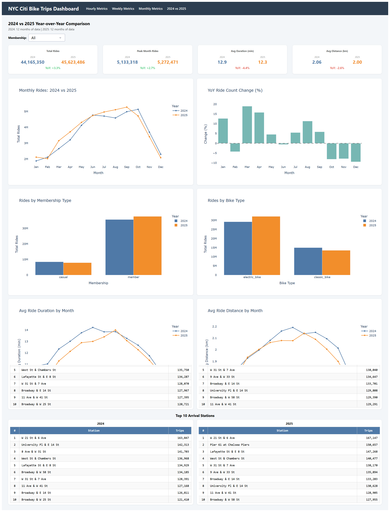

# NYC Citi Bike Data Pipeline

## Table of Contents

- [Overview](#overview)
- [Problem Description](#problem-description)
- [Dashboard Insights](#dashboard-insights)
- [Project Setup](#project-setup)
- [Pipeline Layers](#pipeline-layers)
- [Data Quality Checks](#data-quality-checks)
- [GitHub Actions](#github-actions)

## Overview

This project builds an end-to-end data engineering pipeline for NYC Citi Bike trip data as part of the [Data Engineering Zoomcamp](https://github.com/DataTalksClub/data-engineering-zoomcamp) capstone project.

Raw trip records are fetched monthly from the [Citi Bike public S3 bucket](https://s3.amazonaws.com/tripdata/index.html), landed in **Google Cloud Storage**, loaded and transformed in **BigQuery**, and surfaced through an interactive **Plotly Dash** dashboard. Infrastructure is managed with **Terraform** and the pipeline is orchestrated with **Bruin**.

**Tech stack at a glance:**

| Layer | Tool |
|---|---|
| Infrastructure as Code | Terraform |
| Data Lake | Google Cloud Storage (GCS) |
| Data Warehouse | BigQuery |
| Pipeline Orchestration | Bruin |
| Transformation | BigQuery SQL |
| Dashboard | Plotly Dash |
| Build Automation | Makefile |
| CI | GitHub Actions |

### Pipeline Architecture


---

## Problem Description

New York City's Citi Bike programme generates millions of trip records every month. While the raw data is publicly available, it is split into separate monthly ZIP archives on S3 and contains no pre-computed analytics — making it hard to answer operational and strategic questions across different time scales.

### Intra-Day Patterns
Within a single day, ride demand is far from uniform. Are there clear morning and evening commuter peaks, and do members and casual riders follow fundamentally different demand curves? How do trip duration and distance shift across the hours — do riders travel farther at certain times? Understanding intra-day behaviour is essential for capacity planning and rebalancing docks at high-demand hours.

### Day-of-Week Patterns
Aggregated across the full dataset, certain weekdays consistently attract more rides than others. Do members and casual riders gravitate toward different days — mid-week commuters vs. weekend leisure riders? Does the mix of classic and electric bikes shift depending on the day? Identifying structural day-of-week patterns helps distinguish commuter demand from recreational demand.

### Monthly Trends and Station Activity
Ride volume is strongly seasonal, peaking in summer and troughing in winter, but the magnitude of those swings and how they differ by membership type and bike type are not obvious from raw data. Which stations sustain the highest throughput month after month, and do the top departure and arrival stations coincide? Understanding seasonality and station-level concentration is critical for infrastructure investment decisions.

### Year-over-Year Growth
Comparing 2024 to 2025 in full reveals which months, membership segments, and bike types drove aggregate growth. Was growth evenly distributed across the year, or concentrated in specific months? Did annual members and casual riders move in opposite directions? How rapidly is electric bike adoption displacing classic bikes? Isolating these year-over-year dynamics separates genuine demand growth from seasonal noise.

---

## Dashboard Insights
The following findings are drawn from the interactive dashboard covering **92.8 million trips** across 2024 and 2025 (plus partial 2026 data).

### Page 1 — Hourly Metrics
- **Dual commuter peaks** are clearly visible for members: ride volume surges at **08:00** (5.3 M member rides) and again at **17:00** (7.1 M member rides) — the single busiest hour in the entire dataset.
- **Casual riders show a broad afternoon curve**, building through midday (13:00–16:00, ~1.1–1.3 M rides per hour) and peaking at **17:00 (1.4 M)** — without the sharp twin-spike shape seen for members, and with no distinct morning spike.
- **Trip duration diverges sharply by membership type.** Member average duration ranges ~9–12 min throughout the day (shortest at the pre-dawn 05:00 rush, longest at 17:00), while casual duration peaks at 13:00–14:00 (~21.4 min) — nearly twice as long.
- **Electric bikes lead across all hours**, accounting for roughly 68% of rides at every time slot. The advantage is most pronounced during commute hours, where members strongly prefer e-bikes.
- **Ride distance by hour** is more variable for members, dipping to ~1.8 km at midday (12:00–13:00) and reaching ~2.4 km at the 06:00 commute peak; casual riders maintain a steadier ~2.1–2.4 km throughout the day.
- Weekday trips average **12.0 min** vs. weekend trips **14.1 min**, driven by casual riders extending trip length on weekends.



### Page 2 — Weekly Trend
- **Members** are busiest mid-week: Tuesday (11.9 M) and Wednesday (11.9 M) record the highest ride counts; Sunday (8.6 M) is the quietest day for members.
- **Casual riders** peak on **Saturday** (3.3 M rides, avg 21.1 min / 2.33 km) — their longest and farthest trips of the week — and drop to a low on Monday (2.0 M).
- Overall, **Friday tops total ridership** (14.1 M), while **Sunday is the quietest day** across all riders (11.4 M), lower even than Monday.
- Average distance is slightly higher on weekends for both groups (members: 2.0–2.05 km Sat/Sun vs. ~1.94–1.98 km weekdays), consistent with leisure trip patterns.



### Page 3 — Monthly Metrics (2024 – 2026)
- **Strong seasonality** repeats every year: rides ramp up from March, peak in September–October, and trough in January–February.
- **September 2025** (5.27 M) is the highest single-month total in the dataset; **October 2024** (5.13 M) is the second highest.
- Winter troughs (~1.8–2.1 M in Jan–Feb) are less than **40%** of peak months.
- **2026 data (Jan–Feb):** Jan 2026 recorded 1.81 M rides and Feb 1.21 M, continuing the expected winter dip. Electric bikes already account for ~71% of member rides in these two months, reflecting the accelerating shift away from classic bikes.
- The top 10 departure stations are clustered in Midtown/Chelsea and along the waterfront: **W 21 St & 6 Ave** leads with ~13,200 avg monthly trips, followed by **Pier 61 at Chelsea Piers** (~11,500) and **Lafayette St & E 8 St** (~11,200). The top 10 arrival stations are identical to the top departure stations — the same 10 locations appear in both lists, confirming these as true two-way hubs.



### Page 4 — 2024 vs 2025 Year-over-Year Comparison
- Total rides grew from **44.2 M (2024)** to **45.6 M (2025)**, a net **+3.3%** increase — but the pattern was uneven across months.
- **Growth was concentrated in early 2025**: Jan +12.6%, Mar +18.9%, Apr +15.7%, Aug +11.3%.
- **H2 2025 saw a pullback**: Oct −8.1%, Nov −7.9%, Dec −9.5%, suggesting ridership normalisation after a strong first half.
- **Annual members drove all growth**: +5.6% (35.7 M → 37.7 M), while casual riders declined −6.6% (8.5 M → 7.9 M).
- **Electric bike uptake accelerated**: classic bike rides fell −9.9% (15.0 M → 13.5 M), while electric bike rides rose +10.1% (29.2 M → 32.1 M), pushing e-bikes to **70% of 2025 rides** (up from 66% in 2024).



The Dashboard has been deployed on [Plotly Cloud](https://c363df96-4c8c-4947-9c8f-0b1faeb922f2.plotly.app/) (It will become inaccessible after the GCP project is shut down on 5/11.)

---

## Project Setup

### Prerequisites

Install the following tools before proceeding:

**Terraform**
```bash
wget -O - https://apt.releases.hashicorp.com/gpg | sudo gpg --dearmor -o /usr/share/keyrings/hashicorp-archive-keyring.gpg
echo "deb [arch=$(dpkg --print-architecture) signed-by=/usr/share/keyrings/hashicorp-archive-keyring.gpg] https://apt.releases.hashicorp.com $(grep -oP '(?<=UBUNTU_CODENAME=).*' /etc/os-release || lsb_release -cs) main" | sudo tee /etc/apt/sources.list.d/hashicorp.list
sudo apt update && sudo apt install -y terraform
```

**Bruin**
```bash
curl -LsSf https://getbruin.com/install/cli | sh
```

**uv**
```bash
curl -LsSf https://astral.sh/uv/install.sh | sh
```

Verify installations:

```bash
terraform -version
bruin --version
uv --version
```

---

### 1. GCP Credentials

1. In [Google Cloud Console](https://console.cloud.google.com/), create a service account with the following roles:
   - **BigQuery Admin**
   - **Storage Object Admin**

2. Download the service account JSON key and save it at the **project root** as `de-admin-credentials.json`:

```
Data-Engineering-Zoomcamp-Project/
└── de-admin-credentials.json   ← place it here
```

> This path is the default expected by both Terraform and the dashboard. Do not rename it unless you update the references below.

---

### 2. Configure Each Component

**a) Terraform — `terraform/variables.tf`**

Update the `project` default to match your GCP project ID (the `credentials` path is already set to `../de-admin-credentials.json` relative to the `terraform/` directory):

```hcl
variable "project" {
  description = "GCP Project ID"
  default     = "your-gcp-project-id"   # ← change this
}
```

Alternatively, pass the values at `make` time without editing the file (see the [Running the Pipeline](#running-the-pipeline) section).

---


> **Note:** The repo provides `.bruin.yml.example`. You must rename it to `.bruin.yml` first — Bruin will not read the `.example` file.

```bash
mv .bruin.yml.example .bruin.yml
```

Then edit `.bruin.yml`:

```yaml
default_environment: default
environments:
    default:
        connections:
            google_cloud_platform:
                - name: nyc_citibike
                  project_id: your-gcp-project-id   # ← change this
                  service_account_json: |
                    {
                      "type": "service_account",
                      ...                             # ← paste full JSON key
                    }
```

> The connection name `nyc_citibike` must stay unchanged — it is referenced by every asset in `citibike-pipeline/`.

---

**c) Dashboard — `dashboard/.env`**

> **Note:** The repo provides `dashboard/env.example`. You must rename it to `dashboard/.env` first — the dashboard will not load the `.example` file.

```bash
mv dashboard/env.example dashboard/.env
```

Then edit `dashboard/.env`:

```dotenv
GCP_PROJECT_ID=your-gcp-project-id
GOOGLE_APPLICATION_CREDENTIALS=../de-admin-credentials.json
```

> The credentials path is relative to the `dashboard/` directory. The default `../de-admin-credentials.json` points to the project root where you saved the key.

---

### Running the Pipeline

Once configuration is complete, use `make` to drive the entire workflow.

**Provision infrastructure:**

```bash
make deploy
```

Equivalent bash commands:

```bash
terraform -chdir=terraform init
terraform -chdir=terraform plan
terraform -chdir=terraform apply
```

Or, if you prefer not to edit `variables.tf`, pass the values inline:

```bash
make deploy GCP_PROJECT=your-gcp-project-id GCP_CREDENTIALS=your/path/to/credentials.json
```

Equivalent bash commands:

```bash
terraform -chdir=terraform init
terraform -chdir=terraform plan -var "credentials=your/path/to/credentials.json" -var "project=your-gcp-project-id"
terraform -chdir=terraform apply -var "credentials=your/path/to/credentials.json" -var "project=your-gcp-project-id"
```


**Run the Bruin pipeline** (processes the previous month by default):

```bash
make run
```

Equivalent bash command:

```bash
bruin run ./citibike-pipeline
```

**First run — full historical backfill (required):**

> The staging layer uses a `delete+insert` incremental strategy. On the very first run the staging table does not yet exist, so you **must** pass `FULL_REFRESH=1` to let Bruin create it from scratch. Subsequent scheduled runs (`make run`) can then apply incremental updates safely.

```bash
make run FULL_REFRESH=1 START_DATE=2024-02-15 END_DATE=2026-03-15
```

Equivalent bash command:

```bash
bruin run ./citibike-pipeline --full-refresh --start-date 2024-02-15 --end-date 2026-03-15
```

> Because the Citi Bike data format changed in 2024, this pipeline is designed for the post-2024 file structure, and the pipeline `start_date` must not be earlier than `2024-02-15`.

**Launch the dashboard locally:**

```bash
make dashboard
```

Equivalent bash command:

```bash
cd dashboard && uv sync && uv run plotly app run app:app --host 0.0.0.0 --debug
```

The app will be available at `http://localhost:8050`.

**Tear down infrastructure** (destructive — deletes the GCS bucket and BigQuery datasets):

```bash
make destroy
```

Equivalent bash command:

```bash
terraform -chdir=terraform destroy
```

---

## Pipeline Layers

### Layer 1 — Ingestion (`ingestion.storage` + `raw.citibike_trips`)
The ingestion layer covers both file landing and raw table loading. First, the Python asset `ingestion.storage` downloads the monthly Citi Bike ZIP archives from the public S3 bucket, extracts the CSV files, converts them to Parquet with Polars, and uploads the result to Google Cloud Storage. Then `raw.citibike_trips` loads those landed Parquet files from GCS into BigQuery with minimal reshaping.

This layer is responsible for:
- fetching the source files for each run window
- normalising the file format from CSV to Parquet
- landing the files in GCS
- loading a reproducible raw copy into BigQuery with metadata such as `source_month` and `loaded_at`

### Layer 2 — Staging (`staging.citibike_trips_clean`)
This is the main cleaning and standardisation layer. It trims text fields, filters invalid records, derives trip duration and geospatial distance, and adds analytics-ready columns such as `started_date`, `started_month`, `started_hour`, and `day_of_week`.

This is also the layer where the core data validation logic is applied before records flow into reporting tables.

### Layer 3 — Report (`report.*`)
The report layer contains analytics-ready tables used by the dashboard:

| Table | Description |
|---|---|
| `report.hourly_usage_metrics` | Hourly ride volume, station counts, ride duration, distance, and speed metrics |
| `report.weekly_citibike_trend` | Day-of-week aggregates split by membership type and bike type |
| `report.monthly_citibike_metrics` | Monthly ridership, duration, distance, speed, and station activity summaries |

Together, these three layers separate ingestion, cleaning, and presentation logic, which makes the pipeline easier to maintain and backfill.

---

## Data Quality Checks

The project currently includes **42 Bruin quality checks** across the staging and report layers.

These checks focus on schema reliability and analytical consistency, including:

- `not_null` checks on required business and partition columns
- `accepted_values` checks on controlled dimensions such as `rideable_type` and `member_casual`
- staging-level filtering rules that exclude invalid trips before they reach reporting tables

Examples of records filtered out in staging include:

- rows with missing or invalid latitude/longitude values
- rows where `ended_at < started_at`
- placeholder values such as `ride_id = 'nan'`
- coordinates outside valid geographic bounds

The pipeline also uses idempotent load patterns to keep reruns consistent:

- the raw load deletes the target date window before reinserting it
- the staging table uses incremental `delete+insert` by `started_date`
- report tables are rebuilt with `create+replace`

This means data quality in this project is enforced through a combination of Bruin checks and deterministic reload logic rather than a separate reconciliation framework.

---

## GitHub Actions

The repository currently includes one GitHub Actions workflow: `.github/workflows/bruin-validate.yml`.

This workflow runs when:

- code is pushed to `main`
- the changes affect files under `citibike-pipeline/**`

Its purpose is to run `bruin validate ./citibike-pipeline/` and verify that the pipeline structure, asset metadata, and dependencies are valid before changes are merged into the main workflow.
